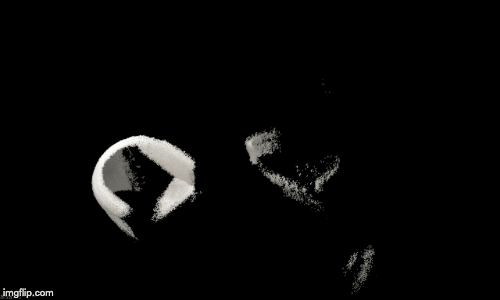
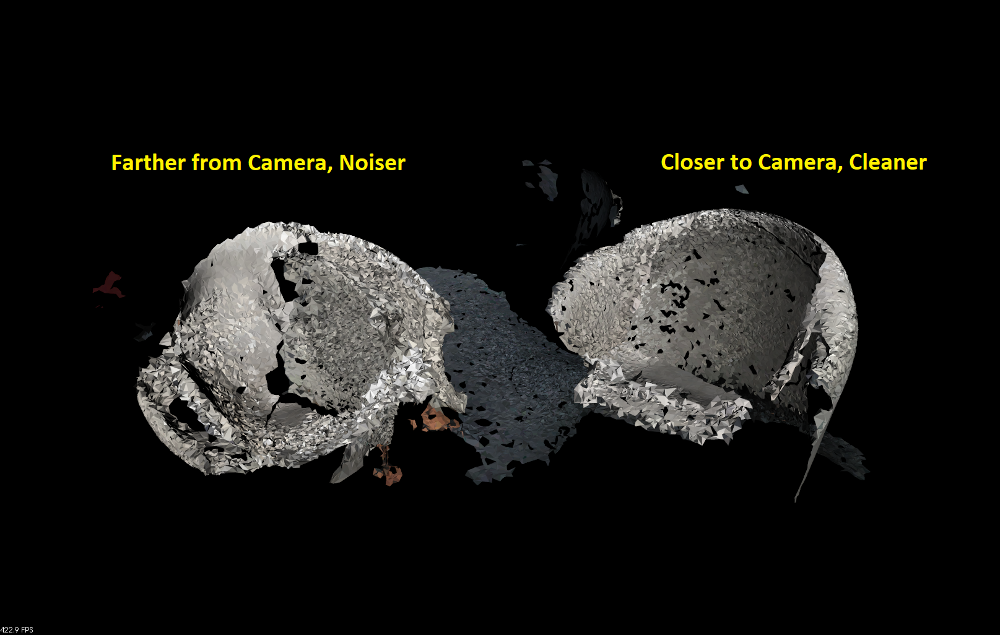

# DroneMOM


## CIS565 Final Project for John Marcao, Eric Micallef, and Taylor Nelms

* Eric Micallef
  * [LinkedIn](https://www.linkedin.com/in/eric-micallef-99291714b/)

* Taylor Nelms
  * [LinkedIn](https://www.linkedin.com/in/taylor-k-7b2110191/), [Twitter](https://twitter.com/nelms_taylor)

* John Marcao
  * [LinkedIn](https://www.linkedin.com/in/jmarcao/), [Personal Website](https://jmarcao.github.io)

## Table of Contents
- [Problem Statement](#Problem-Statement)
- [Repo Structure](#Repo-Structure) 
- [Project Overview](#Project-Overview)
- [Design](#Design)
- [Results](#Results)
- [Build Instructions](#Build-Instructions)

## Problem Statement

Collecting 3D object datasets involves a large amount of manual work and is time consuming. We have built a system that is capable of converting recorded video and depth camera data to generate 3D models on a Nvidia Jetson Nano.

## Project Overview

ROS (Robot Operating System) is heavily used in research. We utilize ROS as a message passing backbone. Our ROS system consists of a central ROS Core and several ROS Nodes that may subscribe and publish messages. We utilized the ROS architecture for our design. This allows us to use ROS bags to replay back our data and refine our algorithms. ROS bags are recorded messages from sensors that can be fed into a ROS system. Our system contains three ROS Nodes we developed: an Object Detection node, a Point Cloud Node, and a Mesh Construction Node. These three nodes combine to form a pipeline that accepts a ROS bag containing video frames and depth sensor data and outputs a GLTF mesh of classified objects. 

The top level README lays out high level functionality of the system. The separate ROS nodes each have a README that contains more information and performance analysis of the individual components.

## Design


The first step in our pipeline is to classify the important objects in a scene. We only generate a point cloud in regions captured by the bouding boxes, reducing the calculations needed.  After classification, the image data and bounding boxes are sent to a point cloud node for generation and labeling. After the point cloud is generated we pass it to a mesh construction node. The mesh construction node further filters and smooths the data to reduce noise from collection sensors. The cloud is then turned into a PCL PolygonMesh using a Greedy Triangulation Algorithm (Marton, et. al.). The data is finally converted into a GLTF file with accompanying binary data. The GLTF output may then be loaded on any GLTF viewer by the end user.

### Object Detection

### Point Cloud



### Mesh Construction


Chair mesh visualized using PCLViewer.

The mesh construction step is done in four steps. First, data is collected from the Point Cloud node and filtered into buckets based on point labels. This allows the mesh construction node to generate unique models for each classified object. The node then performs a Point Reduction step. This will first perform Uniform Samplinng over the cloud. This will split the cloud into a 3D voxel grid and average all points in each voxel to a weighted centroid. It will also average color values. The data is then passed through a filter that removes all nodes with less than 15 neighbors within a given radius. This is done to remove outliers in the data set.

The node then performs mesh construction in two steps. First, Moving Least Squares is applied to the point cloud to smooth the data. This step also generates normals for each points and appends it to the point cloud. Any malformed points are then removed from the cloud and lastly a Greedy Triangulation Algorithm is applied. This algorithm, implemented through the PCL library, looks at all points and connects them to their neighbors. Parameters such as search radius, maximum angles, and minimum angles govern what triangles are formed. The algorithm is "greedy" because once a triangle is formed, it is not removed from the mesh. This creates a bit of a noisy mesh, but makes it easir to generate meshes for noisy and incomplete data. Other methods were tried to poor results, namely Poisson and SDF methods.

Lastly, the mesh is written to a GLTF file. The file contains all information needed to access the GLTF binary that is produced alongside it. The cycle then repeats for each point cloud submitted to the node. All meshes are stored so that the mesh may be inspected over time to see what changes between point cloud messages.



In the above image, the camera was located to the right. As one can see, the closer chair is cleaner and better defined, while the farther chairs is noisier.

## Results

With our ROS nodes we were able to parse the [dataset](#References) provided by the Autonmous Systems Lab at Swiss Federal Instiute of Technology. Below are some examples of the final output.

TODO: Gifs of GLTF files.

## Performance Analysis

Data was collected of running inference on the CPU and GPU FP16 is an optimzation that tensorRT makes where it can turn your FP32 to FP16 types without losing any precision in inference. TensorRT also supports Int8 but this is not supported on the Jetson Nano and as such is not shown. 


## Shortcomings

Overall, we ran into several issues steming from our use of the Jetson Nano. We often run into power draw issues, low memory warnings, and version dependency matches between what the Jetson supports and what other libraries support. Some of these issues could be helped by aggresive optimization and power considerations, as well as disabling uneeded features on the Jetson during runtime (such as the GUI).

For object detection, ...

Version issues with TensorRT. For example, the current Jetpack has TensorRT which supports up to ONNX version .3 the  current ONNX version is 1.5. 

For point cloud generation, ...

For mesh construction, the meshes are still very noisy. A lot of clean data is required for better sampling methods. To improve, either a better algorithm for surface reconstruciton from point clouds needs to be implemented or the point clouds need to be more complete. This is especially difficult since the data format we are using, ROS bags, are not easy to generate without the required hardware.

All being said for 100 dollars the jetson nano is still an impressive piece of hardware. It  just has its limitations as we have found.

## Bloopers

During integration testing, some test points were not being cleared properly and we got some... interesting pictures. You can see the side of several chairs layed out in a star formation.


# Appendix

## Build Instructions

### Do not clone this repo until the instructions tell you to.

you need to build a ROS workspace first...

### Installation

First, install the latest [JetPack](https://developer.nvidia.com/embedded/jetpack) on your Jetson (JetPack 4.2.2 for ROS Melodic or JetPack 3.3 for ROS Kinetic on TX1/TX2).

Once you are logged onto your jetson continue.

### ROS Core

Luckily tensorRT comes pre installed on the jetpack. We just need to insteall a few extra plugins for streaming 

```bash
cd ~
sudo apt-get install git cmake
sudo apt-get update
sudo apt-get install -y dialog
sudo apt-get install -y libglew-dev glew-utils libgstreamer1.0-dev libgstreamer-plugins-base1.0-dev libglib2.0-dev
sudo apt-get install -y libopencv-calib3d-dev libopencv-dev 
sudo apt-get update

```

Install the `ros-melodic-ros-base`package on your Jetson following [these](
https://www.stereolabs.com/blog/ros-and-nvidia-jetson-nano/) directions:

or, here are the necessary commands ( information on the commands is in link above )

```bash
sudo sh -c 'echo "deb http://packages.ros.org/ros/ubuntu $(lsb_release -sc) main" > /etc/apt/sources.list.d/ros-latest.list'
sudo apt-key adv --keyserver 'hkp://keyserver.ubuntu.com:80' --recv-key C1CF6E31E6BADE8868B172B4F42ED6FBAB17C654
sudo apt update
sudo apt install ros-melodic-desktop
sudo rosdep init 
rosdep update
echo "source /opt/ros/melodic/setup.bash" >> ~/.bashrc 
source ~/.bashrc
```

For our project we will need some additional nodes. Install the necessary dependencies by running the commands below. This assumees you are running ROS melodic.

```bash
sudo apt-get install -y ros-melodic-image-transport ros-melodic-image-publisher ros-melodic-vision-msgs ros-melodic-tf2
```

### PCL

Execute the following commands to install the PCL libraries:

```bash
sudo apt-get install -y libpcl-dev ros-melodic-pcl-ros
```

### OpenCV Advanced features

We are using some of the non-standard features from OpenCV (specifically, SURF feature detection). As such, we need to compile and build OpenCV from source. [This Link](https://linuxize.com/post/how-to-install-opencv-on-ubuntu-18-04/) shows how to do it; alternatively, follow these steps:

```bash
sudo apt-get install -y build-essential cmake git pkg-config libgtk-3-dev libglm-dev
sudo apt-get install -y libavcodec-dev libavformat-dev libswscale-dev libv4l-dev libxvidcore-dev libx264-dev
sudo apt-get install -y libjpeg-dev libpng-dev libtiff-dev gfortran openexr libatlas-base-dev libtbb2 libtbb-dev libdc1394-22-dev
sudo apt-get install -y libeigen3-dev libgflags-dev libgoogle-glog-dev libsuitesparse-dev libatlas-base-dev
```
We need to install the Ceres solver as well before we get openCV up and running:

```bash
git clone https://ceres-solver.googlesource.com/ceres-solver
cd ceres-solver
mkdir build && cd build
cmake ..
make -j4
sudo make install
```
Now we can get all the openCV parts together:

```bash
mkdir ~/opencv_build && cd ~/opencv_build
git clone https://github.com/opencv/opencv.git
git clone https://github.com/opencv/opencv_contrib.git
cd ~/opencv_build/opencv
mkdir build && cd build
cmake -D CMAKE_BUILD_TYPE=RELEASE \
    -D CMAKE_INSTALL_PREFIX=/usr/local \
    -D WITH_CUDA=ON \
    -D ENABLE_FAST_MATH=1 \
    -D CUDA_FAST_MATH=1 \
    -D WITH_CUBLAS=1 \
    -D OPENCV_GENERATE_PKGCONFIG=ON \
    -D OPENCV_EXTRA_MODULES_PATH=~/opencv_build/opencv_contrib/modules \
    -D OPENCV_ENABLE_NONFREE=ON ..
make -j4 && sudo make install
```
This process may take a little bit to complete.

### Create Workspace

Now you must make the catkin workspace or your DroneMoM workspace. How ever you like to think about it.

Instructions can be found [here](http://wiki.ros.org/ROS/Tutorials/InstallingandConfiguringROSEnvironment#Create_a_ROS_Workspace):

Or follow these commands. The workspace can be created where ever you are most comfortable below is an example of mine. Please note that catkin looks for the `_ws` so a workspace names `drone_mom_ws` will fail to build.

```bash
mkdir -p ~/CIS565/droneMoM_ws/src
cd ~/CIS565/droneMoM_ws/
catkin_make
source devel/setup.bash
echo $ROS_PACKAGE_PATH
```

Ensure that the path from the echo output matches your path. Assuming you are running ROS melodic it will look something like this

`/home/youruser/CIS565/droneMoM_ws/src:/opt/ros/melodic/share`

### Clone

Now you can clone this repo into the src folder of your newly crated ROS workspace!

### Build 

Navigate to your workspace so `~/CIS565/droneMoM_ws` and type `catkin_make` This will build everything. Ensure there are no errors. Report to me if there are.

That is it! Now you have ROS running and can make your ROS nodes.

### Test 

Open 4 terminals.

This is our roscore terminal it is like a master node ROS can only run with roscore

```bash
source devel/setup.bash
roscore
```

Run this last

```bash
source devel/setup.bash
rosrun image_publisher image_publisher __name:=image_publisher ~/CIS565/jetson-inference/data/images/peds_0.jpg 
```

This will take about 5 minutes the first time as it needs to load the neural network
once this node is ready the image publisher can be started

```bash
source devel/setup.bash
rosrun ros_deep_learning detectnet _model_name:=ssd-mobilenet-v2
```

This is a sample app that gets messages fro mthe detectnet

```bash
source devel/setup.bash
rosrun point_cloud point_cloud
```
### Running ROS bag

you will first need to download a ros bag. Download the machine hall 01 ros bag [here](https://projects.asl.ethz.ch/datasets/doku.php?id=iros2018incrementalobjectdatabase)

After downloading the ros bag open 3 terminals and run these commands

```bash
source devel/setup.bash
roscore
```

```bash
cd ~/Downloads
rosbag play <bag you downloaded>
```


```bash
source devel/setup.bash
rosrun object_detection object_detection model_name:=mobilenet_v2
```

If all goes well the first stageo of the pipeline is running!
To see what topics to subscribe to or what is in the bag type in.

```bash
rosbag info <your bag>
```

# Libraries

* [ROS](https://www.ros.org/) for central architecture and message passing.
* [PCL](http://pointclouds.org/) for Point Cloud and Mesh data types and algorithms.
* [OpenCV](https://opencv.org/) for converting 2D images into 3D point clouds.
* [TensorRT](https://developer.nvidia.com/tensorrt) for accelerated inference.
* [cgltf](https://github.com/jkuhlmann/cgltf) for gltf JSON generation.
* [CMake](https://cmake.org/) for a general build tool.

# References

* [Incremental Object Database: Building 3D Models from Multiple Partial Observations](https://projects.asl.ethz.ch/datasets/doku.php?id=iros2018incrementalobjectdatabase)
* [On Fast Surface Reconstruction Methods for Large and Noisy Datasets](https://ias.informatik.tu-muenchen.de/_media/spezial/bib/marton09icra.pdf)


# Credits 

RandInt8Calibrator.cpp and plugin.cpp are from nvidia and are credited as such. They were needed to perform proper calibration and building of tensorRT engines


