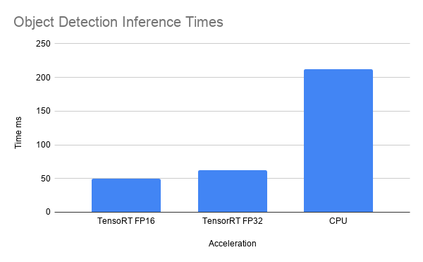

# TensorRT Objections Detection

# Overview

This ros node takes in input from a ros image message and publishes a custom drone mom message which contains bounding boxes, and depth and color maps for generating a point cloud. For more information on the message published you can see .msg file in the drone_mom_msg folder.

# TensorRT Issues

TensorRT is used to acclerate inference on the GPU. To use TensorRT one must first build the engine. This can be done in may ways using a UFF, Caffe Model or ONNX file. Because ONNX is so new and rapidly evolving I had a huge amount of version issues when attmepting to build a network from ONNX file. 

The easiest and least painful way is to freeze a tensorflow graph and then use nvidias uff converter to converter your tensorflow pb file to a uff file. If you can do this succesfully one huge hurdle is out of the way... Seriously it is painful...

The next step is to build the acclerated structure. One must parse the file and then set parameters accordingly.

# Performance Analysis

Data was collected of running inference on the CPU and GPU FP16 is an optimzation that tensorRT makes where it can turn your FP32 to FP16 types without losing any precision in inference. TensorRT also supports Int8 but this is not supported on the Jetson Nano and as such is not shown. 

# Credits 

RandInt8Calibrator.cpp and plugin.cpp are from nvidia and are credited as such. They were needed to perform proper calibration and building of tensorRT engines
